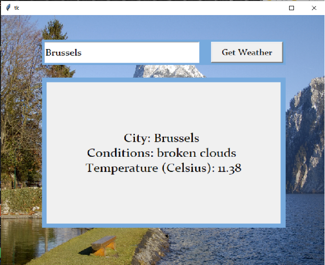
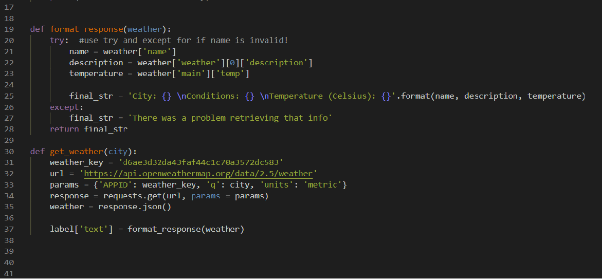

# Weather_GUI

- Repository: `Python`
- Type of challenge:  `Learning`
- Duration: `Half of day project`
- Deadline: `16/11/20 9 A.M.`

## My Project
This is a Graphical User Interface (GUI) made with tkinter to learn even more about the possibilities of python.   
Many videos say that making a GUI is very good for a beginner in python.  
So I did it and it is very interesting and pretty fun to do!  
I did a weather GUI that shows the name of the country chosen, description of the weather and temperature with the help of an api: 'openweathermap.org'.   
I will actually use it often to see the temperature outside :)   
This was once more a very short but interesting project to learn more about my new love for python.  
inspired from: https://www.youtube.com/watch?v=D8-snVfekto&ab_channel=KeithGalli

## Instructions to download it
- click on the file 'Download_Weather_GUI.exe'
- download it in the folder of your choice.
- go into the folder and double click on 'weather.exe'
- You maybe have to enable some things in security or adapt the file if not using windows.
- Tada!! You can see the weather in which city you want just type in the city and click 'Get Weather'

## My GUI 

## My Code

## Enjoy!

